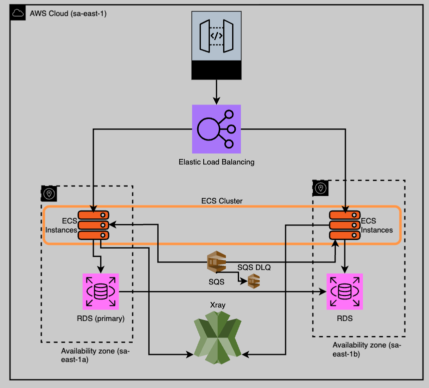

# Autorizador de Transações - Desafio Técnico Itaú

## Visão Geral
Este projeto implementa uma API REST para autorização de transações financeiras (crédito e débito), como parte do desafio técnico para Engenheiro de Software no Itaú Unibanco.

A aplicação consome mensagens de criação de conta de uma fila AWS SQS (usando localstack para desenvolvimento), persiste essas contas em um banco de dados PostgreSQL e expõe endpoints para processar transações, aplicando regras de negócio como a validação de saldo de operações de débito.

O projeto foi construído com foco em boas práticas de engenharia de software, incluindo testes automatizados (TDD), arquitetura limpa, resiliência e observabilidade, visando uma solução "production-ready".

## Tecnologias Utilizadas
* **Linguagem:** Kotlin
* **Framework:** Spring Boot 3.5
* **Persistência de Dados:** Spring Data JPA com Hibernate e PostgreSQL
* **Mensageria:** Spring Cloud AWS para integração com AWS SQS
* **Testes:** JUnit 5, MockK (testes unitários) e Mockito (testes de integração web)
* **Documentação da API:** OpenAPI 3.0 com Swagger UI (via `springdoc-openapi`)
* **Containerização:** Docker e Docker Compose
* **Observabilidade:** Spring Boot Actuator com Micrometer

## Decisões de Arquitetura (ADRs)
As principais decisões de arquitetura tomadas durante o desenvolvimento deste projeto estão documentadas na pasta [`/docs/adr`](./docs/adr).

## Como Executar Localmente
Siga os passos abaixo para executar a aplicação em ambiente local.

### Pré-requisitos
* Java 21 (ou superior)
* Docker e Docker Compose
* AWS CLI (opcional, para interagir com a fila SQS via linha de comando)

### Passos
1.  **Clone o repositório:**
    ```bash
    git clone https://github.com/ariedotme/transaction-authorizer-processo-itau
    cd transaction-authorizer-processo-itau
    ```
2.  **Inicie o ambiente Docker:**
    LocalStack (com a fila SQS), PostgreSQL e gerador de mensagens (que vai popular a fila).
    ```bash
    docker compose up
    ```
    Aguarde a mensagem `message-generator exited with code 0` aparecer no log.

3.  **Execute a aplicação Spring Boot:**
    Você pode executar a classe principal `TransactionAuthorizerApplication.kt` diretamente pela sua IDE (IntelliJ IDEA, por exemplo).

4.  **Verifique se a aplicação está rodando:**
    * A documentação da API estará disponível em: [http://localhost:8080/swagger-ui.html](http://localhost:8080/swagger-ui.html)
    * O endpoint de health check estará em: [http://localhost:8080/actuator/health](http://localhost:8080/actuator/health)

### Resetando o Ambiente Local
Para limpar completamente o ambiente e começar do zero:
```bash
docker compose down -v
```

## Como Usar a API

### Como achar um AccountId para os exemplos
- Conecte-se ao PostgreSQL:
```bash
docker exec -it postgres-db psql -U itau -d authorizer
```
- Execute essa query:
```SQL
SELECT id FROM accounts LIMIT 1;
```
- Copie o UUID
- Substitua [ACCOUNT_ID] nos exemplos pela string copiada

### Exemplo 1: Transação de Crédito bem-sucedida
```bash
curl -X POST 'http://localhost:8080/api/v1/accounts/[ACCOUNT_ID]/transactions/1b2d078f-1619-4d6a-8169-3a135e5d3419' \
--header 'Content-Type: application/json' \
--data '{
    "type": "CREDIT",
    "amount": {
        "value": 150.75,
        "currency": "BRL"
    }
}'
```

### Exemplo 2: Transação de Débito bem-sucedida
```bash
curl -X POST 'http://localhost:8080/api/v1/accounts/[ACCOUNT_ID]/transactions/e4a8f9d8-2e8a-4b6f-b1e0-3d8a9c8b7d6f' \
--header 'Content-Type: application/json' \
--data '{
    "type": "DEBIT",
    "amount": {
        "value": 30.50,
        "currency": "BRL"
    }
}'
```

### Exemplo 3: Transação de Débito recusada (saldo insuficiente)
```bash
curl -X POST 'http://localhost:8080/api/v1/accounts/[ACCOUNT_ID]/transactions/9f8e7d6c-5b4a-3c2b-1a0f-e9d8c7b6a5b4' \
--header 'Content-Type: application/json' \
--data '{
    "type": "DEBIT",
    "amount": {
        "value": 999999.99,
        "currency": "BRL"
    }
}'
```

### Exemplo 4: Tentativa de transação em conta inexistente (erro 404)
```bash
curl -X POST 'http://localhost:8080/api/v1/accounts/11111111-1111-1111-1111-111111111111/transactions/a1b2c3d4-e5f6-a7b8-c9d0-e1f2a3b4c5d6' \
--header 'Content-Type: application/json' \
--data '{
    "type": "CREDIT",
    "amount": {
        "value": 10.00,
        "currency": "BRL"
    }
}'
```

## Observabilidade

### Ambiente de Desenvolvimento (Zipkin)
O ambiente local está configurado para enviar os dados de rastreamento para o Zipkin, que roda em um container Docker.

* Verifique se o ambiente está rodando com docker compose up. O container do Zipkin será iniciado junto.

* Faça algumas chamadas para a API.

* Abra a interface do Zipkin no seu navegador: http://localhost:9411.

* Clique no botão "Run Query".

* Você verá uma lista com cada requisição que fez. Ao clicar em uma, é possível ver um trace detalhado com o tempo de duração, status HTTP, e outras informações para depuração.

### Ambiente de Produção (AWS X-Ray)
A aplicação está configurada para, quando executada com o perfil de Spring prod, desabilitar o exportador do Zipkin e utilizar o exportador padrão OTLP (OpenTelemetry Protocol).

Em um ambiente de produção na AWS, isso permite que a aplicação envie seus traces para um coletor do AWS Distro for OpenTelemetry (ADOT), que por sua vez os encaminha de forma segura e eficiente para o serviço gerenciado AWS X-Ray. Nenhuma alteração no código é necessária para essa mudança de ambiente, garantindo a portabilidade da solução.

## Arquitetura em Nuvem




A arquitetura da aplicação na AWS foi projetada para ser altamente disponível, escalável e resiliente, distribuindo os componentes em múltiplas Zonas de Disponibilidade (AZs) na região sa-east-1.

As requisições chegam através do Amazon API Gateway e são distribuídas por um Elastic Load Balancer entre as instâncias da aplicação. A aplicação roda em containers gerenciados por um Cluster ECS, com instâncias em ambas as AZs para garantir que o serviço continue operando mesmo com a falha de uma zona.

A persistência de dados é feita por um Amazon RDS PostgreSQL configurado em modo Multi-AZ, com uma instância primária em uma AZ e uma réplica de standby em outra, garantindo a recuperação automática em caso de falhas.

O serviço também consome mensagens de uma fila Amazon SQS para o processamento assíncrono de novas contas, e utiliza uma Dead-Letter Queue (DLQ) para tratar falhas.

A observabilidade é garantida pelo envio de dados de rastreamento para o AWS X-Ray.

## Estratégia de Deploy

A entrega da aplicação seria feita através de um pipeline de CI/CD, que automatiza o processo de build, testes e implantação.

Para diminuir os riscos em produção, a estratégia de deploy escolhida é a Blue/Green.

Na prática, mantemos dois ambientes de produção idênticos ("Blue", o ativo, e "Green", o inativo). A nova versão da aplicação é implantada e validada no ambiente Green, sem qualquer impacto para o usuário. Uma vez aprovada, o tráfego é instantaneamente redirecionado do Blue para o Green.

Isso garante um rollback imediato e de baixo risco: se qualquer problema for detectado, o tráfego é revertido para o ambiente Blue original, que ainda está com a versão estável anterior.

### Pipeline de CI/CD
A pipeline de Integração e Entrega contínuas seria a seguinte:

* **CI**: Cada commit de código na branch principal dispara um processo automático que: compila a aplicação, executa todos os testes (unitários e de integração) e, se tudo passar, empacota a aplicação em uma imagem Docker que é enviada para um registro de containers (Amazon ECR).

* **CD (Entrega Contínua)**: Essa nova imagem Docker é então enviada para um ambiente de staging pra uma rodada final de testes automatizados. Após a aprovação, o pipeline promove a versão para o ambiente de produção, utilizando a estratégia Blue/Green sem downtime.

## Possíveis Melhorias Futuras
* **Circuit Breaker**: Se o serviço evoluir para se comunicar com outras APIs, seria essencial implementar o padrão Circuit Breaker para garantir resiliência.
* **Database Migrations**: Em um projeto real, o schema do banco seria gerenciado por uma ferramenta de migração como Liquibase.